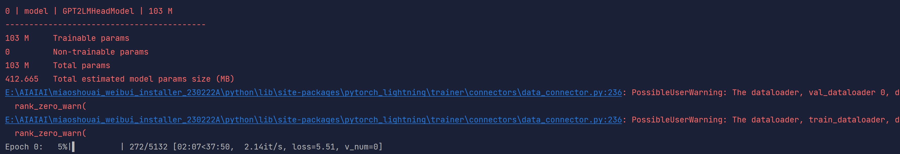
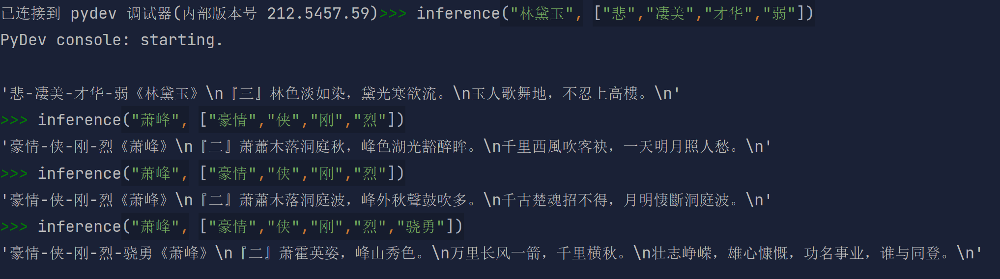

# 
藏头诗生成器
##### 
20212005343 曾荣豪 2107

## 引言: 

本项目是一个基于深度学习的藏头诗生成器，本项目使用的模型是gpt2-chinese-poem，本项目使用的数据集是中华古诗词数据库。

## 1. 项目介绍
藏头诗生成器是按照输入的一个词生成诗句，诗句的每个字都是以输入的一个词开头的，最终生成的内容是以输入的词为主题的一首诗。

## 2. 需求分析
藏头诗生成器需要根据词的每一个字来生成一个诗句，尽量保持诗句的完整性，保证诗句的语法正确，保证诗句的韵律正确，保证诗句的主题正确，保证诗句的结构正确。

## 3. 项目结构
- data：存放数据集
- model：存放模型
- res：存放测试结果
- main.py：训练脚本
- inference.py：测试脚本

## 4. 设计与实现
### 4.1 数据集的获取
本项目使用的数据集是从中华古诗词数据库中获取的，链接为：[中文诗词库](https://github.com/chinese-poetry/chinese-poetry)

### 4.2 数据预处理
1.
    数据预处理的部分主要是对数据集进行分词。首先，我会打开所有的数据集，将数据集保存到panda表中，数据集的基本格式如下：

    `{` `
        "author": "晏殊",` `
        "paragraphs": [` `
        "一霎秋风惊画扇。", ` `
        "艳粉娇红，尚拆荷花面。", ` `
        "草际露垂虫响遍。", ` `
        "珠帘不下留归燕。", ` `
        "扫掠亭台开小院。", ` `
        "四坐清欢，莫放金杯浅。", ` `
        "龟鹤命长松寿远。", ` `
        "阳春一曲情千万。"` `
        ], ` `
        "rhythmic": "蝶恋花"` `
    }`

2. 
    在自然语言处理中，[CLS]指的是分类标签，[SEP]指的是句子分隔符，[MASK]指的是需要预测的词，[PAD]指的是padding的标签。这四个标签是BERT中的标签，BERT是Google在2018年提出的一种基于Transformer的模型，其主要是用于自然语言处理。

    在BERT模型中，输入的句子是经过分词后的句子，然后将输入的句子通过词嵌入层，得到每个词的词向量，然后将得到的词向量输入到Transformer Encoder中，得到Transformer Encoder的输出，然后将Transformer Encoder的输出输入到输出层，得到最终的输出。
    
    本项目使用的模型是BERT模型，所以在数据预处理的过程中，我会将将一首诗随机一到四句诗句的头一个字替换成\[CLS\]，, 把这几个字集中起来保存到一个字符串，如：

    `"[CLS]霎秋风惊画扇。" -> "[CLS]粉娇红，尚拆荷花面。" -> "[CLS]际露垂虫响遍。" -> "[CLS]帘不下留归燕。"
    《一艳草珠》`
    

3. 
    通过jieba工具，将所有的标点符号去掉，将一句完整的诗句分成若干不同的词语，如：
    
    `"[CLS]霎秋风惊画扇。" -> "霎秋风惊画扇" -> ["霎", "秋风", "惊", "画", "扇"]`
    

4.
    将词语形成的列表随机排列，作为初始训练数据，如：
    
    `["霎", "秋风", "惊", "画", "扇"] -> ["秋风", "惊", "霎", "画", "扇"]`

5.
    将对一首诗的拆分过程定义成一个类，即定义这样一个类PoetDataset，可以根据index获取经过处理的诗句，并在这个类定义成员函数collate_fn，用于将一个batch的数据处理成模型可以接受的形式。以及dataloader，用于将数据集分成一个一个的batch。

### 4.3 模型的设计
本项目使用的模型是预训练模型gpt2-chinese-poem，gpt2是OpenAI在2019年提出的一种预训练模型，其主要是用于自然语言处理，gpt2-chinese-poem是gpt2的专门用来生成中国古诗词的模型。

gpt2的输入是分词后的句子，经过词嵌入层后，得到每个词的词向量，然后将词向量输入到Transformer Decoder中，得到Transformer Decoder的输出，然后将Transformer Decoder的输出经过全连接层，得到最终的输出。

gpt2-chinese-poem的输入是分词后的句子，经过词嵌入层后，得到每个词的词向量，然后将词向量输入到Transformer Decoder中，得到Transformer Decoder的输出，然后将Transformer Decoder的输出经过全连接层，得到最终的输出。

### 4.4 模型的训练
模型的训练分成两个模块，一个是数据模块，一个是训练模块。

数据模块的作用是将数据集（前面数据预处理定义的PoetDataset）分成一个一个的batch，然后将一个batch的数据输入到模型中。

训练模块的作用是对模型进行训练，将训练好的模型保存下来。

### 4.5 模型的测试
模型的测试部分主要是对训练好的模型进行测试，得到最终的结果。

要使用这个模型，我在inference.py中先加载预训练好的模型，并定义了生成藏头诗的函数inference，其中，函数参数title作为藏头诗要藏起来的头，keywords作为关键字，可以让藏头诗以期望的意境预测

## 5. 实验结果
### 5.1 训练截图

### 5.2 测试截图

## 6. 总结与讨论
1. 通过这个实验，我了解到基本的深度学习的步骤，即数据预处理，模型设计，模型训练，模型测试。在数据预处理的过程中，一份合适的原始数据集是很重要的，我们需要把数据集修改成适合模型训练的数据集的形式，以更好地训练。在模型设计的过程中，我了解到了gpt2模型的基本原理，以及gpt2模型的输入，我接触到适合生成古诗词的预训练模型，认识到要根据需求选择合适的模型。在模型训练的过程中，我了解到了模型训练的基本步骤，即将数据分成一个一个的batch，然后将一个batch的数据输入到模型中。在模型测试的过程中，我了解到了如何使用训练好的模型，即加载模型，然后输入到模型中，得到最终的结果。

2. 遇到的bug

    `CUDA out of memory`

   经过搜索，我认为出现这个错误的原因是我的显卡显存太低，于是我通过修改batchsize解决了这个问题
               

